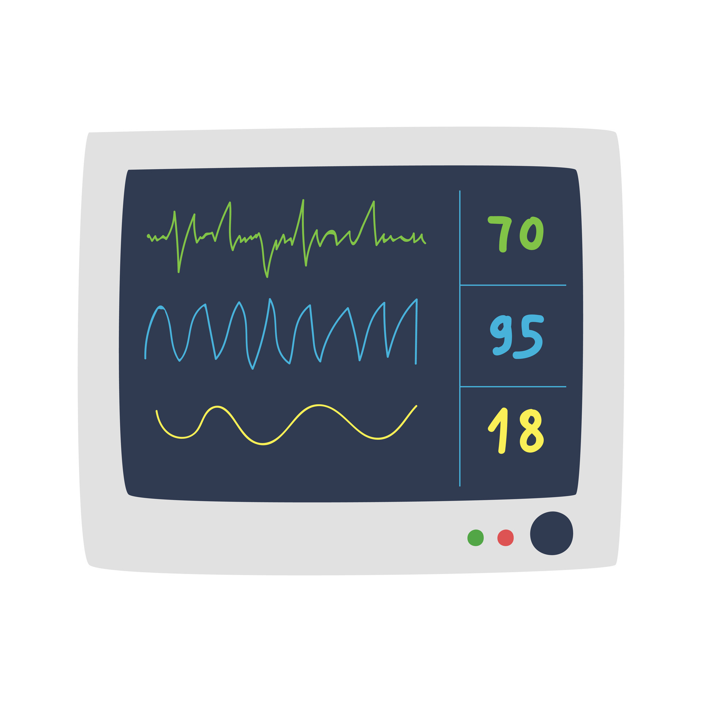

# README: Multipara Monitor Data Interpretation Project



## Problem Statement
The objective is to create a software solution that can accurately extract and
interpret vital signs data such as Heart Rate (HR), Electrocardiogram (ECG) readings, and
oxygen levels from multipara monitors. The software will analyze video feeds from the monitors
and identify the critical data display areas, regardless of the monitor model or screen layout.

## About

This repository contains the project files for the MultiPara Monitor Reading Detector developed by Vineet Kukreti.

## Video Demonstration

In the `/video/` directory, you can find the following video demonstrations:

1. **Working of the Project**: [1_Working_of_the_Project.mp4](/video/1_Working_of_the_Project.mp4)
   - This video demonstrates the working of the MultiPara Monitor Reading Detector.
   - Description about the video [1_working model.txt](video\1_working model.txt)

2. **Training the Model with YOLOv7**: [2_Training the Model with YOLOv7.mp4](video\2_Training_the_Model_with_YOLOv7.mp4)
   - This video shows the process of training the model using YOLOv7.
   - Description about the video [2_model_sumaary.txt](video\2_model_sumaary.txt)

3. **UI Part of the Project**: [3_Frontent_part.txt](video\3_Frontent_part.txt)
   - This video showcases the user interface part of the project.

## Setting up the Environment

### Prerequisites
- Python installed on your system.
- Anaconda (optional but recommended for managing virtual environments).

### Steps
1. Navigate to the Project Directory
    ```bash
    cd multipara-monitor-interpreter
    ```

2. Create a Virtual Environment (Using Anaconda - Optional)
    ```bash
    conda create --name multipara-env python=3.8
    conda activate multipara-env
    ```
    If you prefer using virtualenv:
    ```bash
    virtualenv multipara-env
    source multipara-env/bin/activate
    ```

3. Navigate to YOLOv7 Folder
    ```bash
    cd YOLOv7
    ```

4. Install Dependencies
    ```bash
    pip install -r requirements.txt
    ```

## Running the Application
- Run the `app.py` File
    ```bash
    python app.py
    ```

## Access the Application
- Open your preferred web browser and go to: [http://localhost:5000](http://localhost:5000)

## Additional Notes
- Ensure that the virtual environment is activated before running the application.
- For YOLOv7 specific details, refer to the `YOLOv7/README.md` file.
- If using Anaconda, you can manage environments using the Anaconda Navigator or command-line tools.

## Contact Information
- For any inquiries or issues, please contact Vineet Kukreti at [vineetkukreti34@gmail.com](mailto:vineetkukreti34@gmail.com).

Enjoy using the Multipara Monitor Data Interpretation Project!
